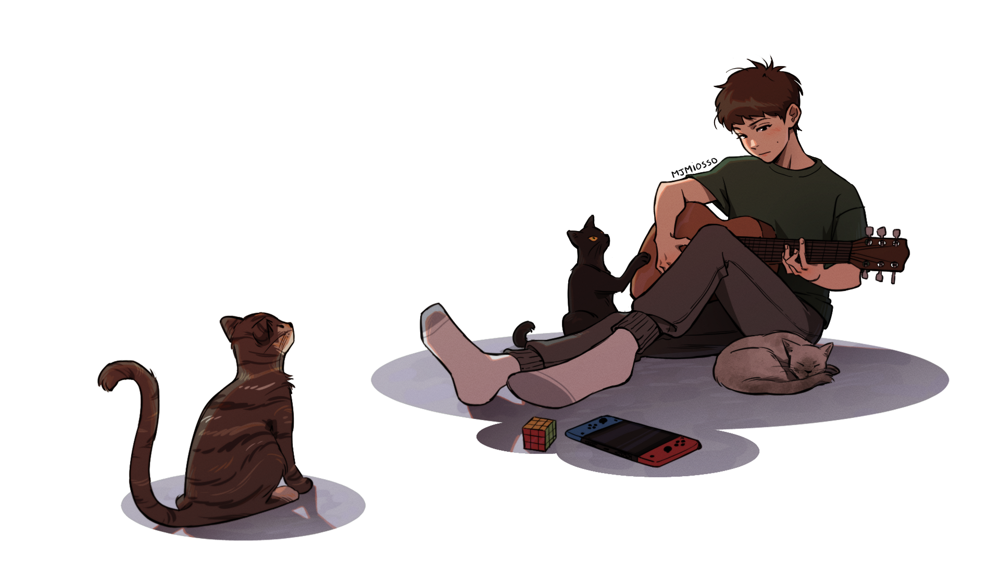

  

"

###

  
  

###

  

###

<h1 align="center">Olá! 👋</h1>

###

<h3 align="left">👩‍💻  Sobre mim</h3>

###
"

Eu sou Maria Júlia, dev full-stack e atualmente estudando na Escola de Tecnologia DNC.  - 📚 Atualmente estou aprendendo React e SASS - 📫 Contate-me mjuliamiosso@gmail.com - ⚡ No meu tempo livre gosto de desenhar, tocar violão e jogar

###

<h3 align="left">Linguagens</h3>

###

  
  
  
  
  
  
  
  
  
  
  

###

<h3 align="left">🔥   Meu status :</h3>

###

  
  

###